# News_Harbor
News Harbor is modern media site, powered by AI aricle generations.

Visit website:

[NEWS HARBOR](http://dawidlycz2.pythonanywhere.com/)

## About the App
News Harbor is a web application built on the Django framework, allowing users to browse articles about various topics. Modern design imporoves user expirience. Additionally, the application has possibility to generate article about any topic by simply providing it in one text field.

### Key Features:
* News Browsing: News Harbor is media website, therefore it provides possibility to read various articles about any topic.

* Feedback System: Website allows logged users to leave a like, or even a comment regarding specific article, so they might express their sentiment about article. Comment system also allows to leave a like or dislike to specific comment.

* Article and Image divide: One of adventages of News Harbor is division of articles and images in database. This means one article might have assigned many images, and one image might be assigned to many articles. This provides flexibility for creators.

* Tag System: Every article and every image has assigned many tags, which makes it easer to find, simply by searching it, in searchfield.

* Editor Panel: This feature might be only for editors, but its worth of mentioning. Website has modern editor panel, that probides possibility to create, edit, and delete articles, images, and tags in comfortable way.

* User-Friendly Interface: The app features a user-friendly interface. The intuitive design ensures seamless navigation through the wealth of available information.

* AI Article Generation: Main feature of News Harbor is possibility to generate articles with help of artificial inteligence. In editors panel, mentioned before, there is possibility to provide a topic, and send request to AI endpoint, which returns article. Next, article is formatted by script, so it fits perfectly to a database.

* API: Application has API. More information about it, directly in website.
### Become an Editor:
I would like to share experience of being a editor on this website, so if you are intrested in, you can make your own article.
We will toghether make an article about Japan.
Please just follow these steps:

At first, you must log in. In top right corner, you can see that you are logged as a guest. In order to change that, click "log in".

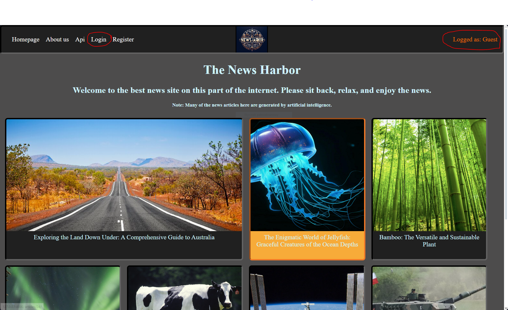

Now you are in login screen. Here you must provide username and password. For purpose of tutrial i have prepered account already.

username: Besteditor123 password: password321

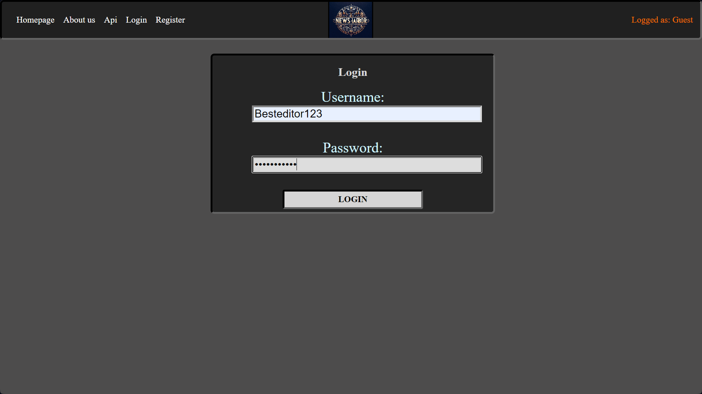

After you click login, you can see in top right corner your username. Let's move to editor panel. You can find it just next to your username.

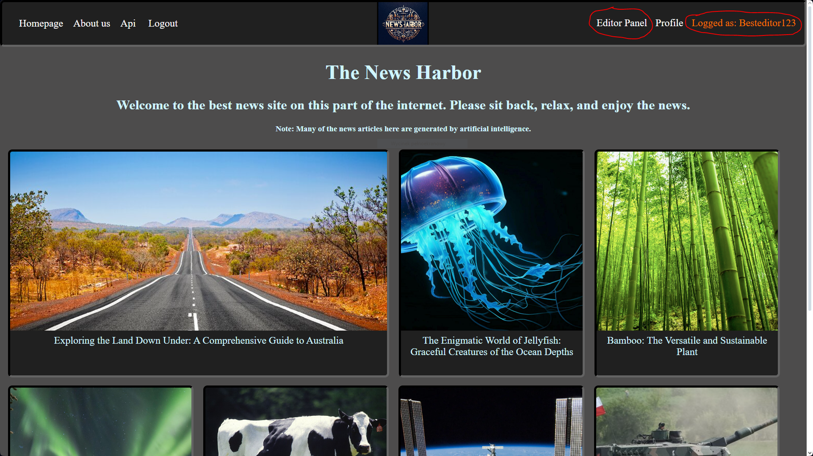

Now you are in editor panel. Here you can manage website. Let's just focus on our article. Click on "Create New Article".

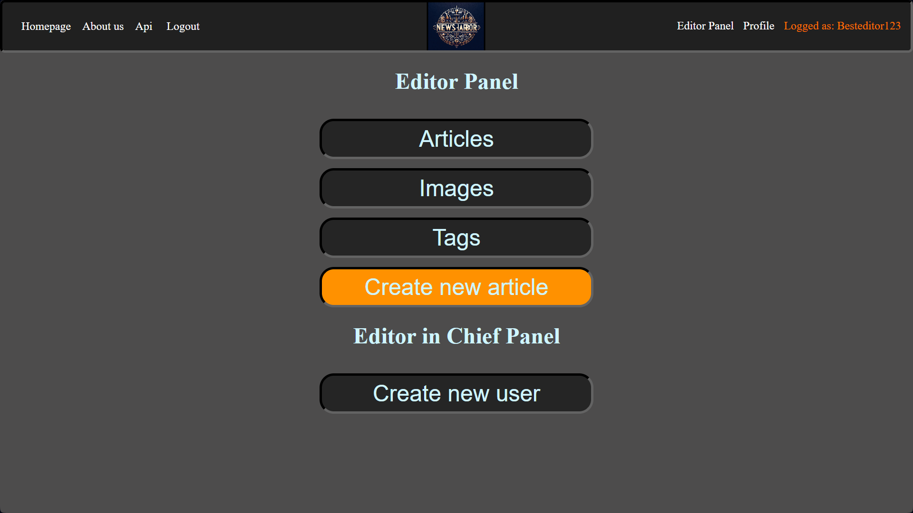

We are now in article editing panel. Here you can add text, photos, tags to an article. It is recommended to start with text.
Let's just use AI feature. Scroll down and input "Japan" in textfield, than click a "Generate" button and wait a while.
(This might take some time, one minute max)

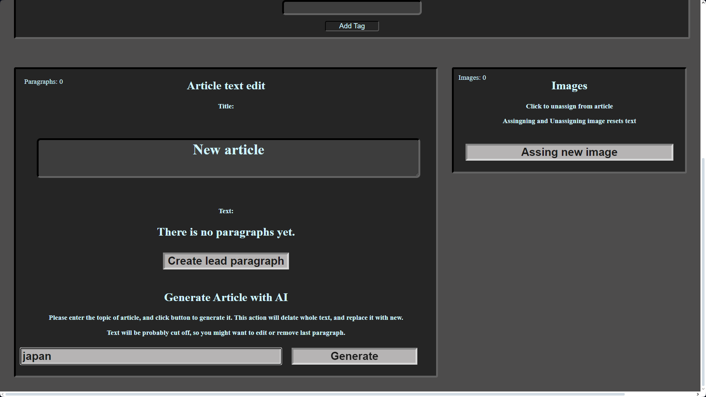

Now you can see that article has been generated and divided into paragraphs. Most likely last paragraph is cuted off, so you might want to delete it completly, or delete only last sentence of it.
After that, remember to save it, with "Save Text" button below.
(In case title of article is "format error", scroll down, and generate it again).
Now let's focus on images. There are already few images regarding Japan in database. They can be assigned by button: "Assign new Image".

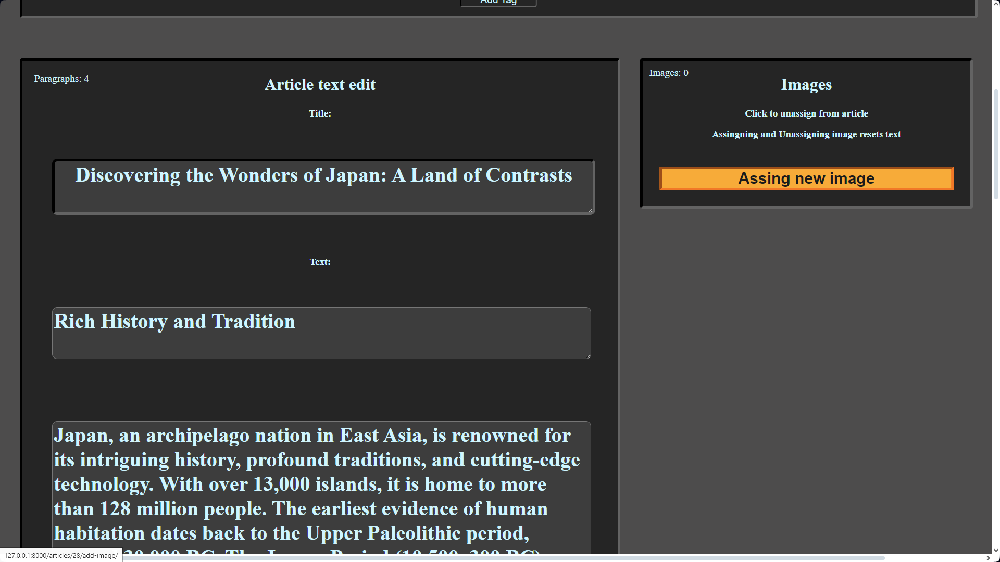

This is image assigning panel, here you can assign image to an article. There are already few images that would fit article about Japan. Click one of them to assign it.

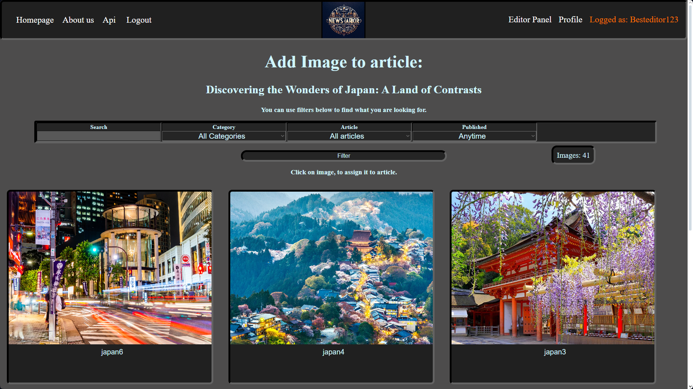

As you can see, you are back in article edit panel. In image box, appears image that you assinged. Now assign few more.

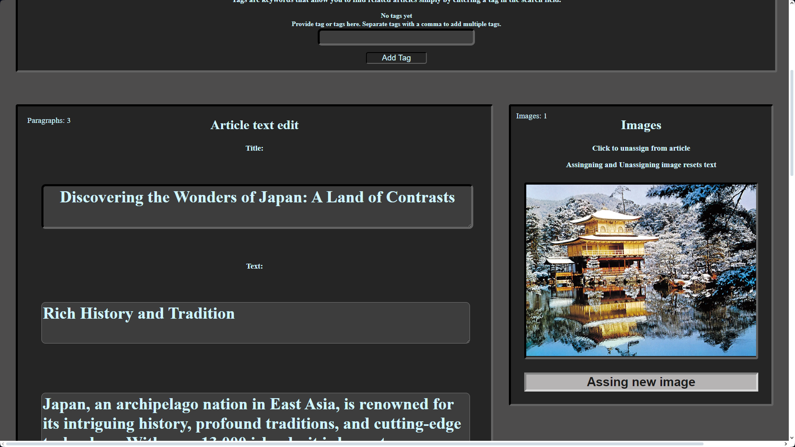

There are 5 images regarding Japan: japan1, japan2, japan3, japan5, japan6 (there is no nr5). You can find them manually, or by typing in "japan" in search field.
After that, you should see all of them in image box, and in top left corner you should see that you assigned "Images: 5".

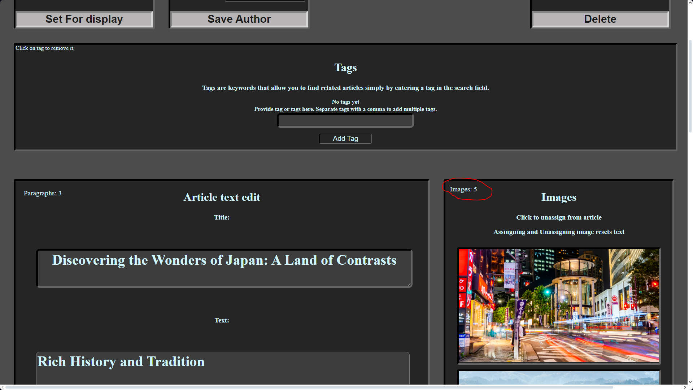

Now when it't all done, it is good idea to provide some tags. Above, there is tag managment panel, you can type in tags here. You don't have to type in tags one by one, you can simply add multiple tags simply by separeting them with comma and click "Add tag" button.
You can add as many tags as you want, but its sufficient to add those: asia, japan, travel, nature

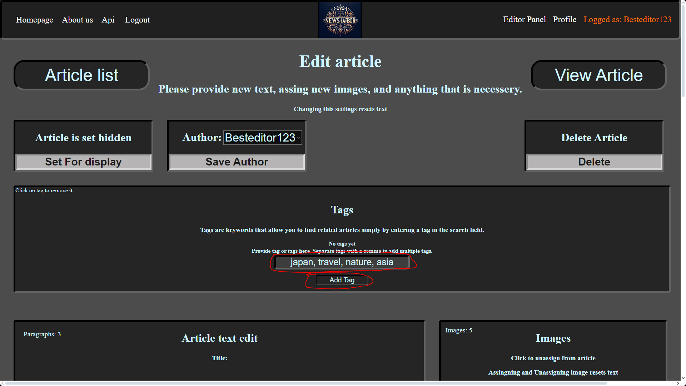

Laset but not least, you must set this article visible. You can make it simply by clicking button "Set For display" in top right.

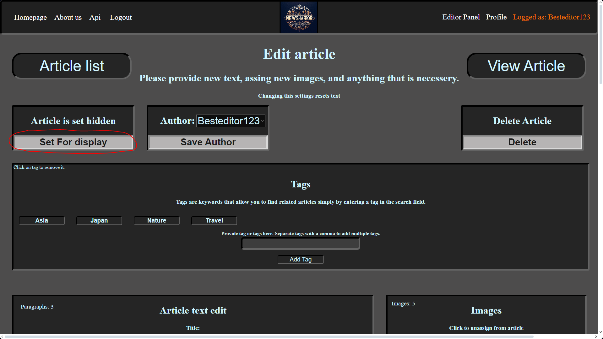

Thats it. Article is ready. You should be able to see it, on a homepage.

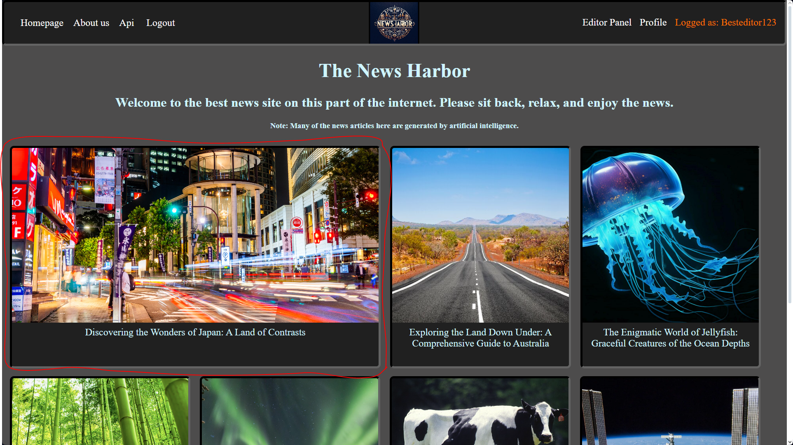

## Dependencies

The project relies on the following Python libraries and packages:

- [mysqlclient](https://pypi.org/project/mysqlclient/): A MySQL database connector for Django.
- [Django Rest Framework](https://www.django-rest-framework.org): A tool to create and use API.
Make sure to install these dependencies by running the following command:

```bash
pip install -r requirements.txt
